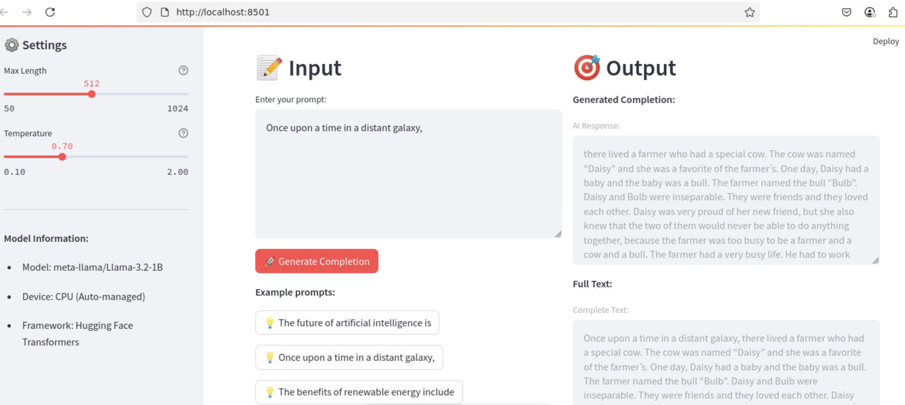

# 🤖 AI Text Completion App

A fully functional Streamlit application that provides AI-powered text completion using Meta's Llama-3.2-1B model. This app runs efficiently on both CPU and GPU with automatic device detection and provides an intuitive web interface for generating text completions.

## 📸 App Interface



*Screenshot showing the clean, modern interface with input/output sections and customizable settings*

## ✨ Features

- **Modern Web Interface**: Clean and responsive Streamlit GUI
- **AI-Powered Completions**: Uses Meta's Llama-3.2-1B model for text generation
- **Flexible Hardware Support**: Runs efficiently on both CPU and GPU with automatic device detection
- **Customizable Settings**: Adjustable temperature and max length parameters
- **Real-time Generation**: Fast text completion with progress indicators
- **Example Prompts**: Pre-loaded example prompts to get started quickly
- **Statistics Display**: Shows input/output length metrics
- **Model Caching**: Efficient model loading with Streamlit caching

## 🚀 Quick Start

### Prerequisites

- Python 3.8 or higher
- At least 4GB of RAM (8GB+ recommended)
- Internet connection for initial model download
- Optional: CUDA-compatible GPU for faster inference

### Installation

1. **Clone or download the project files**
   ```bash
   # Make sure you have app.py and requirements.txt in your directory
   ```

2. **Install dependencies**
   ```bash
   pip install -r requirements.txt
   ```

3. **Run the application**
   ```bash
   streamlit run app.py
   ```

4. **Access the app**
   - Open your web browser
   - Navigate to `http://localhost:8501`
   - The app will automatically download the model on first run (this may take a few minutes)
   - GPU will be used automatically if available, otherwise falls back to CPU

## 🎯 How to Use

1. **Enter Your Prompt**: Type or paste your text in the input area on the left side
2. **Adjust Settings** (Optional): 
   - Use the sidebar to modify temperature (creativity) and max length
   - Higher temperature = more creative output
   - Lower temperature = more focused output
3. **Generate Completion**: Click the "🚀 Generate Completion" button
4. **View Results**: The AI-generated completion will appear on the right side
5. **Try Examples**: Use the example prompts for quick testing

## ⚙️ Configuration

### Model Settings

- **Model**: meta-llama/Llama-3.2-1B
- **Device**: GPU (if available) or CPU (automatic detection)
- **Max Length**: 50-1024 tokens (adjustable)
- **Temperature**: 0.1-2.0 (adjustable)

### Performance Tips

- **First Run**: Model download takes 2-5 minutes depending on internet speed
- **Subsequent Runs**: Model is cached and loads much faster
- **GPU Usage**: Automatically detects and uses GPU if available for faster inference
- **CPU Fallback**: Seamlessly falls back to CPU if no GPU is available
- **Memory Usage**: ~2-4GB RAM (CPU) or ~3-6GB VRAM (GPU) during operation
- **Generation Speed**: 
  - GPU: Typically 1-3 seconds per completion
  - CPU: Typically 5-15 seconds per completion

## 📁 Project Structure

```
streamlittest/
├── app.py              # Main Streamlit application
├── requirements.txt    # Python dependencies
└── README.md          # This file
```

## 🔧 Technical Details

### Dependencies

- **Streamlit**: Web framework for the GUI
- **PyTorch**: Machine learning framework
- **Transformers**: Hugging Face library for LLM integration
- **Accelerate**: Optimization library for model loading

### Model Information

- **Name**: meta-llama/Llama-3.2-1B
- **Size**: ~2.5GB download
- **Type**: Causal Language Model
- **Hardware**: Supports both GPU and CPU inference
- **Precision**: Automatic (optimized for available hardware)

## 🎨 Features Breakdown

### User Interface
- Clean, modern design with emoji icons
- Two-column layout: Input | Output
- Sidebar for settings and model information
- Real-time statistics display

### AI Integration
- Efficient model loading with caching
- Error handling for model failures
- Automatic GPU/CPU detection and optimization
- Customizable generation parameters

### User Experience
- Loading spinners for better feedback
- Example prompts for quick start
- Input validation and warnings
- Responsive design for different screen sizes

## 🐛 Troubleshooting

### Common Issues

1. **Model Loading Fails**
   - Check internet connection
   - Ensure sufficient disk space (5GB+)
   - Restart the application

2. **Out of Memory Error**
   - Close other applications
   - Reduce max_length parameter
   - Ensure sufficient RAM (CPU) or VRAM (GPU)
   - Try switching between GPU/CPU modes

3. **Slow Generation**
   - GPU mode provides faster inference than CPU
   - Consider reducing max_length for faster results
   - First-time model download creates temporary slowdown

### Getting Help

If you encounter issues:
1. Check the error messages in the Streamlit interface
2. Verify all dependencies are installed correctly
3. Ensure you have sufficient system resources

## 📝 Example Prompts

Try these prompts to get started:

- "The future of artificial intelligence is"
- "Once upon a time in a distant galaxy,"
- "The benefits of renewable energy include"
- "In the year 2050, technology will"
- "The most important skill for future jobs is"

## 🚀 Next Steps

Potential enhancements:
- Add support for different models
- Implement conversation history
- Add export functionality
- Include prompt templates
- Add batch processing capabilities

---

**Made with ❤️ using Streamlit and Hugging Face Transformers** 